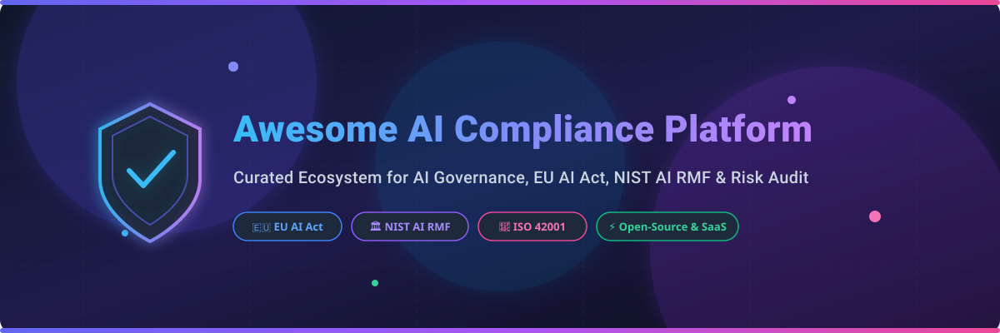

# 🛡️ Awesome AI Compliance Platform Ecosystem

  
  
  
  
  

> **A curated, audit-ready index of enterprise SaaS platforms and open-source GitHub projects for AI Governance, Model Risk Management (MRM), EU AI Act Alignment, NIST AI RMF, ISO 42001 Certification, and Responsible AI Auditability.**

---

## 📚 Table of Contents
- [📖 Overview & SEO Keywords](#-overview--seo-keywords)
- [🏢 SaaS & Enterprise Hosted Platforms](#-saas--enterprise-hosted-platforms)
- [💻 Open-Source GitHub Repositories](#-open-source-github-repositories)
- [📝 Compliance Frameworks & Reference Standards](#-compliance-frameworks--reference-standards)
- [🤝 How to Contribute](#-how-to-contribute)
- [💖 Support & Sponsorship](#-support--sponsorship)
- [📈 Star History](#-star-history)
- [⚠️ Disclaimer](#%EF%B8%8F-disclaimer)

---

## 📖 Overview & SEO Keywords

The global regulatory environment—marked by the **EU AI Act**, **NIST AI Risk Management Framework (AI RMF)**, **ISO/IEC 42001**, and **US Executive Orders on AI**—requires enterprise organizations to maintain an inventory of AI systems, perform risk tiering, enforce policy guardrails, and generate audit-ready compliance evidence packs.

This repository tracks the leading **commercial SaaS solutions** and **community open-source toolkits** for:
- ⚖️ **AI Governance & Compliance Software**
- 🛡️ **Model Risk Management (MRM)**
- 🇪🇺 **EU AI Act Risk Classification & Technical Documentation**
- 🏛️ **NIST AI RMF Playbooks & ISO 42001 Controls**
- 🔍 **LLM Guardrails, Bias Detection, Evaluation & Decision Audit Logging**

---

## 🏢 SaaS & Enterprise Hosted Platforms

💡 **Market Size & Industry Structure**:  
The Global AI Governance & Compliance Software market is estimated at **$550M+ in 2024–2026** and projected to expand to **$4.8B+ by 2030 (CAGR ~38.5%)**, driven by mandatory compliance penalties under the EU AI Act and enterprise safety requirements. The market is **moderately fragmented**: mega-cap cloud providers and legacy GRC leaders (Microsoft, IBM, OneTrust, SAS) offer broad AI governance modules alongside specialized venture-backed pioneers (Credo AI, ModelOp, CalypsoAI, Holistic AI) delivering deep, AI-native risk workflows.

> **Note**: Platforms below are sorted by **Company Valuation / Revenue / Size (Descending)**.

| Platform | Description & Focus | Company Size / Valuation / Funding | Pricing Tier (Starting Price) | Free Tier / Free Trial Limits |
| :--- | :--- | :--- | :--- | :--- |
| **[Microsoft Purview AI Hub](https://www.microsoft.com/en-us/security/business/compliance/microsoft-purview)** | Enterprise AI data security, governance, regulatory policy enforcement, and compliance monitoring across Copilot and custom LLMs. | **$3.1 Trillion** (Public - MSFT, 220,000+ employees) | Included in Microsoft 365 E5 / Purview Compliance starting at **$57/user/month** | **90-Day Free Trial** (Microsoft 365 E5 compliance trial up to 25 licenses) |
| **[IBM watsonx.governance](https://www.ibm.com/products/watsonx-governance)** | End-to-end model risk management, governance, policy enforcement, and automated compliance reporting for predictive & generative AI. | **$200+ Billion** (Public - IBM, 280,000+ employees) | Essentials tier starting at **$3,500/month** per instance (or ~$0.64/model-hour usage) | **30-Day Free Trial** on IBM Cloud (includes 1,500 free resource units) |
| **[SAS AI Governance](https://www.sas.com/en_us/software/viya.html)** | Enterprise AI lifecycle management, governance dashboards, trustworthy AI policy enforcement, and compliance auditing. | **$3.2B+ Annual Revenue** (Privately held, 12,000+ employees) | Base platform subscription starting at **~$25,000/year** (custom enterprise quote) | **14-Day Hosted Free Trial** via SAS Viya trial environment |
| **[OneTrust AI Governance](https://www.onetrust.com/products/ai-governance/)** | Market-leading enterprise GRC suite with dedicated modules for AI inventory, risk assessments, and EU AI Act alignment. | **$4.5 Billion Valuation** ($1B+ raised, 2,500+ employees) | Modular licensing starting at **$10,000/year** base minimum ($50,000+ typical enterprise contract) | **14-Day Guided Sandbox Trial** available upon demo request |
| **[CalypsoAI](https://calypsoai.com/)** | Enterprise LLM security, prompt policy enforcement, guardrails, and compliance audit trail logging (Acquired by F5 Networks). | **Acquired by F5 Networks** ($12B+ Market Cap, $43.2M VC funding prior) | Enterprise licensing starting at **~$35,000/year** per deployment | **14-Day Proof-of-Concept (POC)** sandbox environment via sales request |
| **[ModelOp](https://www.modelop.com/)** | Comprehensive Model Risk Management (MRM) software automated for financial services and regulated enterprise AI operations. | **$16.0M VC Funding** (Series B, 50-100 employees) | Enterprise platform tier starting at **$50,000/year** | **30-Day Managed Demo / POC** sandbox environment upon request |
| **[Monitaur](https://monitaur.ai/)** | Machine learning auditability and model governance platform designed for insurance, finance, and regulated industries. | **$13.2M VC Funding** (Series A, 10-50 employees) | Enterprise governance tier starting at **$15,000/year** | **14-Day Guided Demo / POC** environment available upon request |
| **[Credo AI](https://www.credo.ai/)** | Full-lifecycle AI governance, policy catalog, impact assessment, and automated EU AI Act / NIST AI RMF evidence generation. | **$12.8M VC Funding** (Series A, 50-150 employees) | Growth tier starting at **$15,000/year**; custom enterprise licensing | **14-Day Interactive Self-Serve / Guided Trial** |
| **[Holistic AI](https://www.holisticai.com/)** | AI risk management and bias auditing platform offering model registries, risk assessments, and regulatory compliance packs. | **~$10.0M VC Funding** (Series A, 50-100 employees) | Risk assessment suite starting at **~$20,000/year** | **14-Day Sample Risk Audit Sandbox Trial** |
| **[Trustible](https://www.trustible.ai/)** | AI governance software helping legal and risk teams build AI inventories, classify risks, and satisfy EU AI Act requirements. | **$7.69M VC Funding** (Seed, 10-50 employees) | Growth plan starting at **$12,000/year**; custom enterprise tier | **14-Day Interactive Sandbox Trial** for AI system registration |
| **[Credal](https://www.credal.ai/)** | Secure enterprise AI platform enforcing data privacy, PII redacting, policy controls, and audit trails for LLM agents. | **$5.3M VC Funding** (Seed stage, Y Combinator backed, 10-30 employees) | Teams tier starting at **$1,000/month** ($12,000/year); pay-as-you-go enterprise usage | **14-Day Developer & Enterprise Trial** environment |
| **[FairNow](https://fairnow.ai/)** | AI governance and algorithmic bias auditing software (Acquired by AuditBoard for enterprise GRC integration). | **Acquired by AuditBoard** ($3.5M initial seed funding) | Annual subscription starting at **$10,000/year** | **14-Day Guided Demo & Audit Sandbox Trial** |

---

## 💻 Open-Source GitHub Repositories

Below is the list of leading open-source repositories powering AI documentation, model cards, LLM guardrails, data drift detection, and compliance tooling.

> **Note**: Repositories are sorted by **GitHub Star Count (Descending)**.

| Repository & Stargazers Link | Description & Compliance Utility | GitHub Star Badge |
| :--- | :--- | :--- |
| **[open-metadata/OpenMetadata](https://github.com/open-metadata/OpenMetadata)** | Unified metadata platform featuring automated AI model asset discovery, data lineage, and compliance audit tracking. |  |
| **[arize-ai/phoenix](https://github.com/arize-ai/phoenix)** | Open-source AI observability platform for tracing, evaluations, prompt engineering, and LLM guardrail compliance evidence. |  |
| **[evidentlyai/evidently](https://github.com/evidentlyai/evidently)** | Open-source ML and LLM evaluation suite for data drift monitoring, performance auditing, and technical evidence generation. |  |
| **[guardrails-ai/guardrails](https://github.com/guardrails-ai/guardrails)** | Open-source framework for validating and structuring LLM outputs, enforcing safety policies, and logging compliance controls. |  |
| **[NVIDIA/NeMo-Guardrails](https://github.com/NVIDIA/NeMo-Guardrails)** | Toolkit for adding programmable guardrails to LLM applications to ensure conversational safety, topic enforcement, and control logging. |  |
| **[giskard-ai/giskard](https://github.com/giskard-ai/giskard)** | Open-source testing framework for AI models to detect hallucination, bias, security vulnerabilities, and compliance flaws. |  |
| **[deepchecks/deepchecks](https://github.com/deepchecks/deepchecks)** | Continuous validation library for machine learning models and LLMs to automate QA, data integrity, and compliance reporting. |  |
| **[truera/trulens](https://github.com/truera/trulens)** | Open-source instrumentation toolkit for evaluating, tracking, and auditing LLM applications and RAG chains against risk standards. |  |
| **[protectai/llm-guard](https://github.com/protectai/llm-guard)** | Security toolkit for LLMs designed to sanitize prompts and outputs against toxicity, prompt injection, and PII leakage. |  |
| **[tensorflow/model-card-toolkit](https://github.com/tensorflow/model-card-toolkit)** | Standardized toolkit for automating the generation of Model Cards to satisfy model documentation requirements. |  |
| **[SdSarthak/AegisAI](https://github.com/SdSarthak/AegisAI)** | Open-source AI-GRC platform oriented to EU AI Act workflows—system registration, risk classification, and technical documentation. |  |

---

## 📝 Compliance Frameworks & Reference Standards

1. **🇪🇺 EU AI Act (Regulation EU 2024/1689)**:
   - Risk Tiers: Prohibited, High-Risk, Specific Transparency Risk, Minimal Risk.
   - Requirements: Quality management systems, technical documentation, automatic logging, human oversight, cybersecurity.
2. **🏛️ NIST AI Risk Management Framework (AI RMF 1.0)**:
   - Core Functions: *GOVERN*, *MAP*, *MEASURE*, *MANAGE*.
   - Playbooks for trustworthy AI systems (accuracy, safety, security, transparency, explainability, fairness).
3. **📜 ISO/IEC 42001:2023**:
   - Standard for Artificial Intelligence Management System (AIMS).
   - Establishes controls for AI policy, risk assessment, impact assessment, and vendor management.

---

## 🤝 How to Contribute

Contributions are warmly welcomed! Please follow these simple steps:

1. 🍴 **Fork** this repository.
2. 📝 Add or update SaaS / Open-source entries in `README.md` maintaining the existing table formats.
3. 🔎 Ensure all company funding/pricing data or open-source star links are factual and up-to-date.
4. 🚀 Open a **Pull Request** with a brief summary of additions.

Curated with ❤️ for the global AI Governance and Responsible AI community!

---

## 💖 Support & Sponsorship

Thank you for visiting and supporting the **Awesome AI Compliance Platform** initiative! If you find this curated list valuable for your AI Governance work, research, or organizational compliance programs, please consider supporting the project:

- ⭐ **Star this repository** to help others discover it!
- 🔀 **Fork and share** with your network, colleagues, and AI risk teams.
- ☕ **Sponsor / Buy Me a Coffee**: Support ongoing open-source maintenance via [GitHub Sponsors](https://github.com/sponsors/ishandutta2007).

---

## 📈 Star History

---

## ⚠️ Disclaimer

- This is a **community-curated index** for informational and educational purposes only.
- Software tools and platforms do not constitute legal advice. AI compliance requirements (such as the EU AI Act or sector regulations) require qualified legal counsel, formal conformity assessments, and organizational oversight.
- Check official documentation and vendor sites for real-time pricing, features, and licensing terms.

---

  Maintained by <a href="https://github.com/ishandutta2007"><b>Ishan Dutta</b></a> | Powered by <a href="https://github.com/ishandutta2007/Awesome-Awesome-Awesome"><b>Awesome-Awesome-Awesome</b></a>

